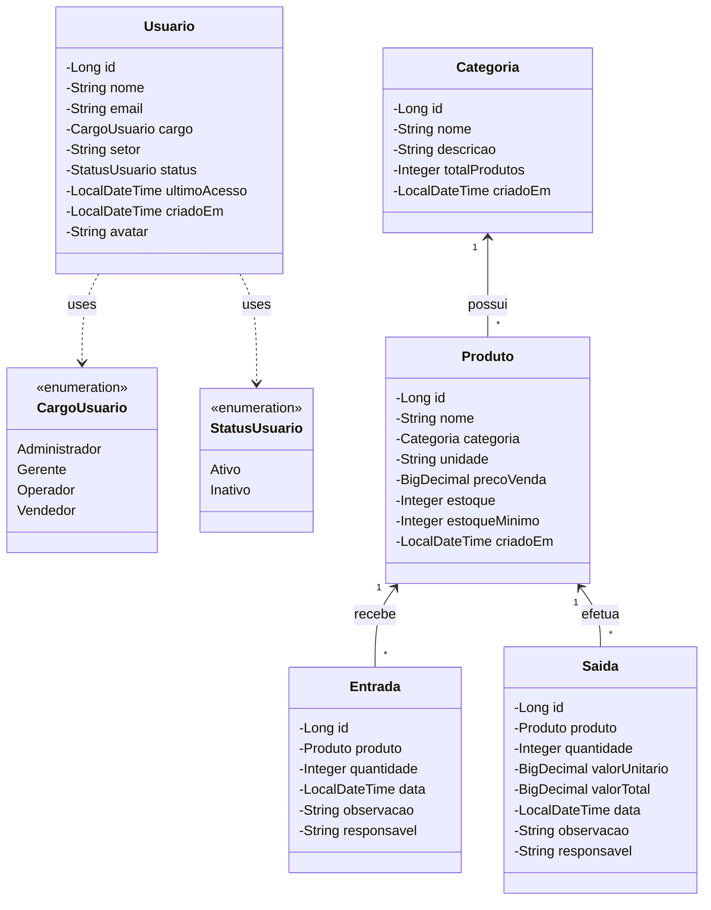

# Diagrama de Classes — Pão da Vida Control

Este documento apresenta o detalhamento do diagrama de classes para o sistema **Pão da Vida Control** (Sistema de Controle de Estoque e Vendas para Padarias). O diagrama foi modelado refletindo as estruturas de dados e regras de negócio utilizadas no frontend da aplicação.

---

## 1. Visualização do Diagrama

---

## 2. Detalhamento dos Enumerados (Enumerations)

### 2.1. `CargoUsuario`
Define os cargos e níveis de acesso dos usuários no sistema.
* **Valores:**
  * `Administrador`: Acesso total ao sistema, relatórios e configurações.
  * `Gerente`: Gerenciamento de operações, produção e equipes.
  * `Operador`: Operação de produção e registro de entradas no estoque.
  * `Vendedor`: Operação de vendas e registro de saídas no estoque.

### 2.2. `StatusUsuario`
Representa a situação atual da conta do usuário.
* **Valores:**
  * `Ativo`: Usuário com acesso liberado ao sistema.
  * `Inativo`: Usuário com acesso bloqueado ou desativado.

---

## 3. Detalhamento das Classes

### 3.1. Class `Usuario`
Representa os colaboradores que interagem com o sistema e realizam as operações.

#### Atributos (Privados `-`)
| Nome | Tipo | Descrição |
| :--- | :--- | :--- |
| `id` | `Long` | Identificador único autoincremental no banco de dados. |
| `nome` | `String` | Nome completo do usuário. |
| `email` | `String` | E-mail do usuário (utilizado para autenticação e comunicação). |
| `cargo` | `CargoUsuario` | Cargo e nível de acesso do usuário. |
| `setor` | `String` | Setor de atuação do usuário na padaria. |
| `status` | `StatusUsuario` | Flag indicando o status atual da conta. |
| `ultimoAcesso` | `LocalDateTime` | Registro da última vez que o usuário se autenticou. |
| `criadoEm` | `LocalDateTime` | Data e hora de criação do registro. |
| `avatar` | `String` | Representação visual (iniciais ou link da imagem) do usuário. |

---

### 3.2. Class `Categoria`
Agrupa produtos com características semelhantes (ex: Pães, Bolos, Salgados).

#### Atributos (Privados `-`)
| Nome | Tipo | Descrição |
| :--- | :--- | :--- |
| `id` | `Long` | Identificador único da categoria. |
| `nome` | `String` | Nome descritivo da categoria. |
| `descricao` | `String` | Explicação detalhada sobre a categoria. |
| `totalProdutos` | `Integer` | Quantidade de produtos vinculados a esta categoria. |
| `criadoEm` | `LocalDateTime` | Data e hora de criação. |

---

### 3.3. Class `Produto`
Representa os itens produzidos ou comercializados pela padaria.

#### Atributos (Privados `-`)
| Nome | Tipo | Descrição |
| :--- | :--- | :--- |
| `id` | `Long` | Identificador único do produto. |
| `nome` | `String` | Nome comercial do produto. |
| `categoria` | `Categoria` | Categoria na qual o produto está classificado. |
| `unidade` | `String` | Unidade de medida associada ao produto (ex: unid, fatia). |
| `precoVenda` | `BigDecimal` | Preço de venda unitário do produto. |
| `estoque` | `Integer` | Quantidade atual física do produto em estoque. |
| `estoqueMinimo` | `Integer` | Quantidade mínima recomendada para evitar desabastecimento. |
| `criadoEm` | `LocalDateTime` | Data e hora de cadastro do produto. |

---

### 3.4. Class `Entrada` (StockEntry)
Registra o histórico de produção e entrada física de produtos no estoque.

#### Atributos (Privados `-`)
| Nome | Tipo | Descrição |
| :--- | :--- | :--- |
| `id` | `Long` | Identificador único da movimentação de entrada. |
| `produto` | `Produto` | Produto ao qual esta movimentação se refere. |
| `quantidade` | `Integer` | Quantidade produzida ou adicionada ao estoque. |
| `data` | `LocalDateTime` | Data e hora exatas do registro de entrada. |
| `observacao` | `String` | Texto livre para anotações ou justificativas. |
| `responsavel` | `String` | Nome do colaborador responsável por registrar a entrada. |

---

### 3.5. Class `Saida` (StockExit)
Registra todo o histórico de vendas e saídas de produtos do estoque.

#### Atributos (Privados `-`)
| Nome | Tipo | Descrição |
| :--- | :--- | :--- |
| `id` | `Long` | Identificador único da movimentação de saída. |
| `produto` | `Produto` | Produto ao qual esta movimentação se refere. |
| `quantidade` | `Integer` | Quantidade vendida ou retirada do estoque. |
| `valorUnitario` | `BigDecimal` | Preço unitário do produto no momento do registro. |
| `valorTotal` | `BigDecimal` | Valor total da linha (`quantidade` * `valorUnitario`). |
| `data` | `LocalDateTime` | Data e hora exatas do registro de saída. |
| `observacao` | `String` | Texto livre para anotações ou justificativas (ex: "Venda balcão"). |
| `responsavel` | `String` | Nome do colaborador responsável por registrar a saída. |

---

## 4. Associações e Relacionamentos

1. **Associação Categoria — Produto (`1 <-- *`)**:
   * Uma categoria pode ter múltiplos (`*`) produtos vinculados a ela.
   
2. **Associação Produto — Entrada (`1 <-- *`)**:
   * Um produto pode possuir **múltiplas** entradas (histórico de produção).

3. **Associação Produto — Saida (`1 <-- *`)**:
   * Um produto pode possuir **múltiplas** saídas (histórico de vendas).

4. **Dependências (`<<uses>>`)**:
   * As classes utilizam as enumerations (`CargoUsuario`, `StatusUsuario`) para tipar e limitar os valores de seus respectivos campos específicos.
