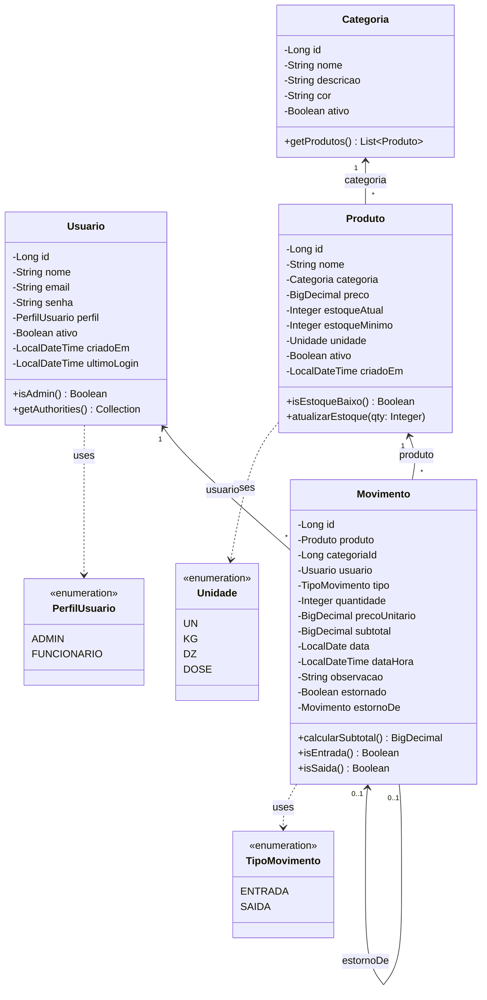
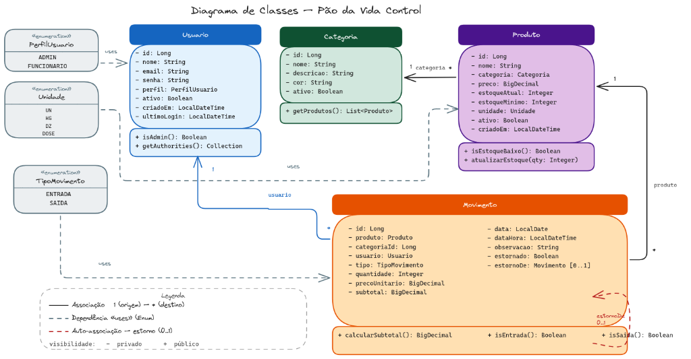

# Diagrama de Classes — Pão da Vida Control

Este documento apresenta o detalhamento do diagrama de classes para o sistema **Pão da Vida Control** (Sistema de Controle de Estoque e Vendas para Padarias). O diagrama foi modelado utilizando a notação UML (Unified Modeling Language) e reflete a arquitetura do banco de dados e as entidades de negócio.

---

## 1. Visualização do Diagrama

---

## 2. Detalhamento dos Enumerados (Enumerations)

### 2.1. `PerfilUsuario`
Define os perfis de acesso e autorização dos usuários no sistema (Role-Based Access Control - RBAC).
* **Valores:**
  * `ADMIN`: Usuário administrador com acesso total às configurações, relatórios e cadastros.
  * `FUNCIONARIO`: Usuário operacional com permissões limitadas a registros de produção (entradas) e vendas (saídas).

### 2.2. `Unidade`
Representa a unidade de medida utilizada para quantificar os produtos no estoque.
* **Valores:**
  * `UN` (Unidade)
  * `KG` (Quilograma)
  * `DZ` (Dúzia)
  * `DOSE` (Dose)

### 2.3. `TipoMovimento`
Classifica as movimentações de estoque.
* **Valores:**
  * `ENTRADA`: Incremento no estoque (tipicamente vindo da produção).
  * `SAIDA`: Decremento no estoque (vendas, descartes ou perdas).

---

## 3. Detalhamento das Classes

### 3.1. Class `Usuario`
Representa as pessoas cadastradas que interagem com o sistema e realizam as operações.

#### Atributos (Privados `-`)
| Nome | Tipo | Descrição |
| :--- | :--- | :--- |
| `id` | `Long` | Identificador único autoincremental no banco de dados. |
| `nome` | `String` | Nome completo do usuário. |
| `email` | `String` | E-mail do usuário (utilizado para autenticação e deve ser único). |
| `senha` | `String` | Senha criptografada (hash). |
| `perfil` | `PerfilUsuario` | Nível de acesso do usuário. |
| `ativo` | `Boolean` | Flag indicando se a conta está ativa no sistema. |
| `criadoEm` | `LocalDateTime` | Data e hora de criação do registro. |
| `ultimoLogin` | `LocalDateTime` | Registro da última vez que o usuário se autenticou. |

#### Métodos (Públicos `+`)
* `isAdmin(): Boolean`
  * Retorna verdadeiro (`true`) se o perfil do usuário for `ADMIN`.
* `getAuthorities(): Collection`
  * Retorna a lista de roles/permissões do usuário no formato esperado pelo Spring Security.

---

### 3.2. Class `Categoria`
Agrupa produtos com características semelhantes (ex: Pães, Doces, Bebidas).

#### Atributos (Privados `-`)
| Nome | Tipo | Descrição |
| :--- | :--- | :--- |
| `id` | `Long` | Identificador único da categoria. |
| `nome` | `String` | Nome descritivo da categoria. |
| `descricao` | `String` | Explicação detalhada sobre a categoria. |
| `cor` | `String` | Código hexadecimal da cor associada à categoria (para fins de estilização e gráficos). |
| `ativo` | `Boolean` | Flag de controle para exclusão lógica (indica se a categoria está ativa). |

#### Métodos (Públicos `+`)
* `getProdutos(): List<Produto>`
  * Retorna a lista de produtos pertencentes a esta categoria.

---

### 3.3. Class `Produto`
Representa os itens produzidos ou comercializados pela padaria.

#### Atributos (Privados `-`)
| Nome | Tipo | Descrição |
| :--- | :--- | :--- |
| `id` | `Long` | Identificador único do produto. |
| `nome` | `String` | Nome comercial do produto. |
| `categoria` | `Categoria` | Categoria na qual o produto está classificado. |
| `preco` | `BigDecimal` | Preço de venda unitário do produto. |
| `estoqueAtual` | `Integer` | Quantidade atual física do produto em estoque. |
| `estoqueMinimo` | `Integer` | Quantidade mínima recomendada para evitar desabastecimento. |
| `unidade` | `Unidade` | Unidade de medida associada ao produto. |
| `ativo` | `Boolean` | Controle de exclusão lógica do produto. |
| `criadoEm` | `LocalDateTime` | Data e hora de cadastro do produto. |

#### Métodos (Públicos `+`)
* `isEstoqueBaixo(): Boolean`
  * Verifica se a quantidade em `estoqueAtual` é menor do que a definida em `estoqueMinimo`.
* `atualizarEstoque(qty: Integer)`
  * Incrementa ou decrementa o valor de `estoqueAtual` a partir de uma quantidade informada (positivo para entradas, negativo para saídas).

---

### 3.4. Class `Movimento`
Registra todo o histórico de entradas e saídas físicas dos produtos no estoque, servindo também para o cálculo de vendas e relatórios de fluxo.

#### Atributos (Privados `-`)
| Nome | Tipo | Descrição |
| :--- | :--- | :--- |
| `id` | `Long` | Identificador único da movimentação. |
| `produto` | `Produto` | Produto ao qual esta movimentação se refere. |
| `categoriaId` | `Long` | Cópia redundante ou lógica do ID da categoria do produto para fins de facilidade em relatórios. |
| `usuario` | `Usuario` | Usuário que efetuou a movimentação de estoque. |
| `tipo` | `TipoMovimento` | Tipo de movimentação (`ENTRADA` ou `SAIDA`). |
| `quantidade` | `Integer` | Quantidade movimentada. |
| `precoUnitario` | `BigDecimal` | Preço unitário do produto no momento do registro. |
| `subtotal` | `BigDecimal` | Valor total da linha (`quantidade` * `precoUnitario`). |
| `data` | `LocalDate` | Data sem hora da realização do evento (útil para agrupamentos). |
| `dataHora` | `LocalDateTime` | Data e hora exatas do registro. |
| `observacao` | `String` | Texto livre para anotações ou justificativas (ex: "Perda por validade" ou "Produção manhã"). |
| `estornado` | `Boolean` | Indica se este movimento foi cancelado/estornado. |
| `estornoDe` | `Movimento` | Associação opcional (`[0..1]`) indicando o movimento original caso este registro seja um estorno. |

#### Métodos (Públicos `+`)
* `calcularSubtotal(): BigDecimal`
  * Multiplica a quantidade pelo preço unitário e atribui/retorna o resultado no atributo `subtotal`.
* `isEntrada(): Boolean`
  * Retorna verdadeiro se o tipo de movimento for `ENTRADA`.
* `isSaida(): Boolean`
  * Retorna verdadeiro se o tipo de movimento for `SAIDA`.

---

## 4. Associações e Relacionamentos

1. **Associação Categoria — Produto (`1 <-- *`)**:
   * Um produto obrigatoriamente possui **1** categoria associada.
   * Uma categoria pode ter múltiplos (`*`) produtos vinculados a ela.
   
2. **Associação Produto — Movimento (`1 <-- *`)**:
   * Cada movimento está obrigatoriamente associado a **1** produto.
   * Um produto pode possuir **múltiplas** movimentações históricas.

3. **Associação Usuario — Movimento (`1 <-- *`)**:
   * Cada movimentação é realizada e registrada por **1** usuário.
   * Um usuário pode registrar **múltiplas** movimentações de estoque.

4. **Auto-associação Movimento — Estorno (`0..1 <-- 0..1`)**:
   * Um movimento pode apontar para outro movimento original do qual ele é o estorno (estornoDe). Esse relacionamento é opcional (`0..1`), permitindo rastrear o histórico de cancelamentos de forma íntegra.

5. **Dependências (`<<uses>>`)**:
   * As classes utilizam as enumerations (`PerfilUsuario`, `Unidade` e `TipoMovimento`) para tipar e limitar os valores de seus respectivos campos específicos.
